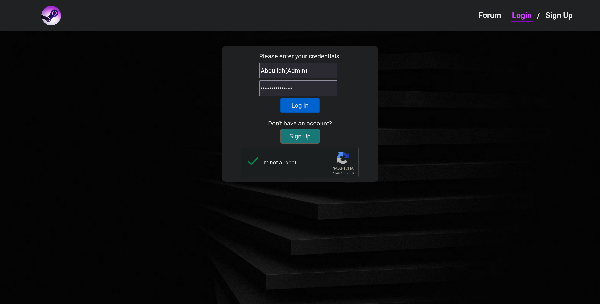
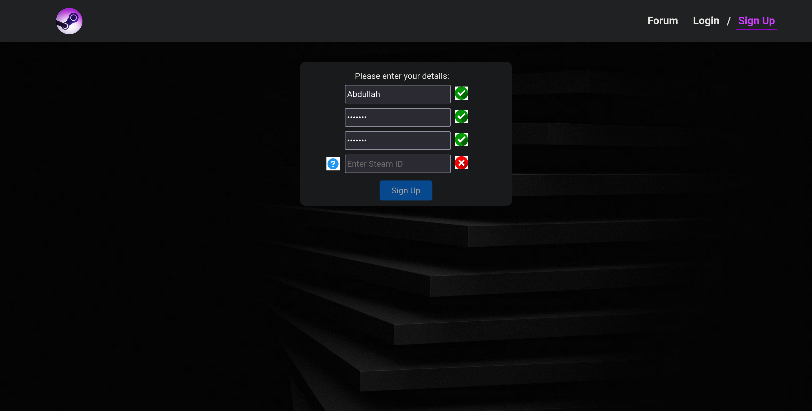
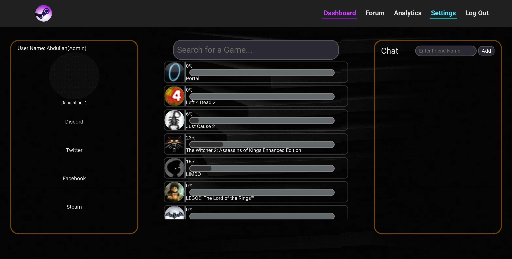
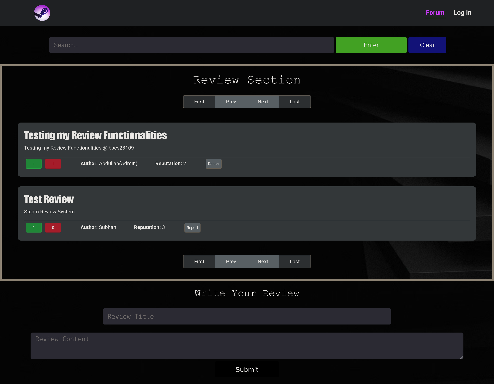
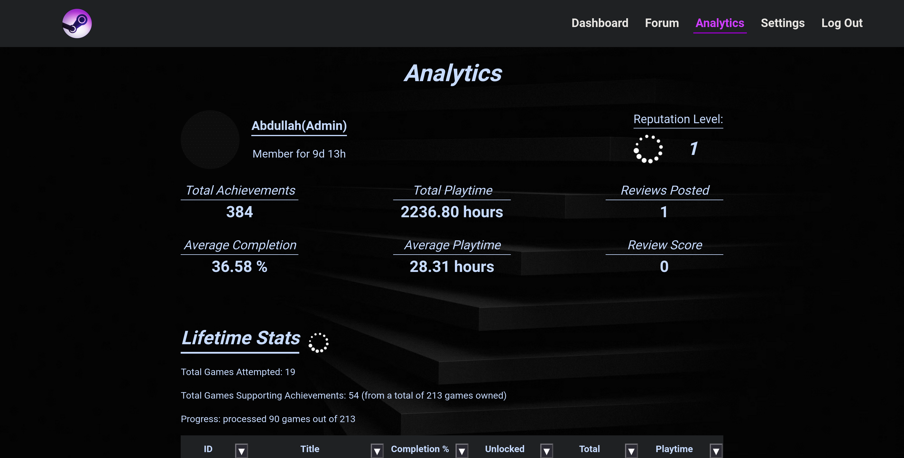
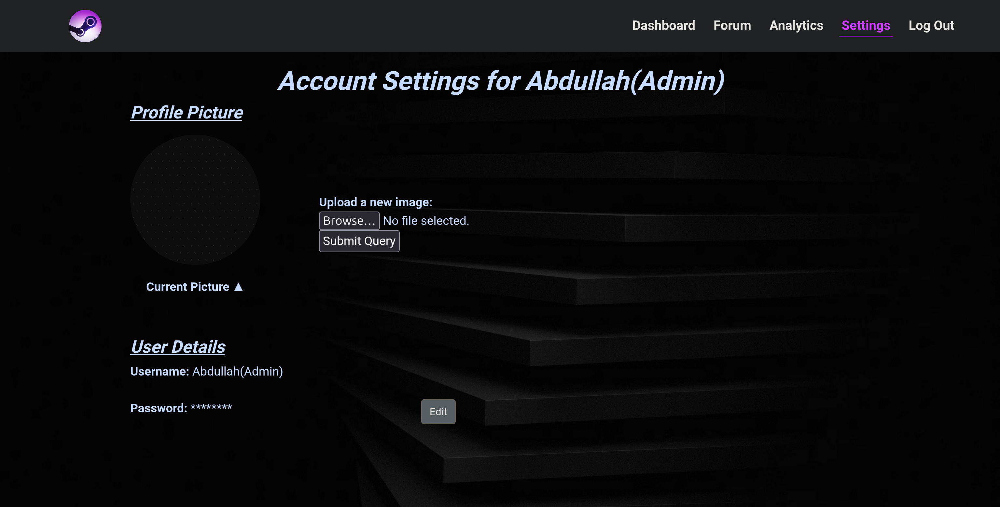
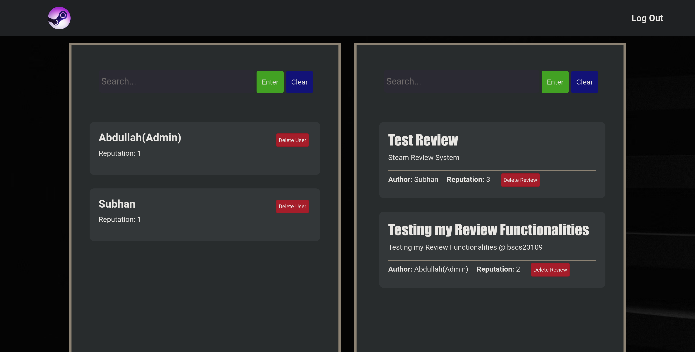

# Game Achievement Tracker for Steam
This project is my semester-long assignment for the Database Systems course. It’s a web application that connects to the Steamworks Web API to display visual insights into game achievements and playtime stats for Steam users. Built with the MERN stack (MongoDB, Express, React, and Node.js), the app lets users track their progress and compare achievements with others. The focus is on creating a user-friendly and visually engaging experience while applying concepts from both database management and full-stack development. This project combines my academic learning with my interest in gaming.

## Features 

### **1. Login Page**  



- **Details**:  
  - Enter a valid username and password.  
  - Complete a CAPTCHA for security.  
- **Purpose**: Ensures secure access to your account.  

---

### **2. Sign Up Page**  

- **Details**:  
  - Choose a unique username.  
  - Provide a valid Steam ID (validated via an API call).  
  - Password must have a minimum length of 4 characters.  
  - **Note**: Usernames starting with "admin" are not allowed.  


---


### **3. Main Dashboard Page**  

- **Overview**: Your hub for all things gaming.  
  - **User Information**:  
    - Displays your profile, reputation, and social handles (Discord, Twitter, Facebook, Steam).  
  - **Chat Box**:  
    - Chat with your friends.  
    - Add new friends by searching for their username.  
  - **Games Overview**:  
    - View all games you own, along with their completion percentages.  
    - Click a game to view its unlocked achievements.  
    - Search for specific games on the dashboard.  


---


### **4. Forum/Reviews Page**  

- **Details**:  
  - Share your reviews about games and achievements.  
  - Engage with the gaming community by reading and posting reviews.  


---


### **5. Analytics Page**  

- **Details**: A detailed breakdown of your gaming stats.  
  - Shows:  
    - Username.  
    - Total achievements.  
    - Average completion percentage.  
    - Total and average playtime.  
    - Reviews posted and scores.  
    - Reputation level.  
    - Lifetime stats:  
      - Total games attempted.  
      - Games supporting achievements.  
      - All games with their individual stats in a tabular format.  


---


### **6. User Settings Page**  

- **Details**:  
  - Update your details like password and profile picture.  
  - Username cannot be edited (ensures uniqueness).  


---


### **7. Admin Page**  

- **Details**:  
  - **Admin Privileges**:  
    - Delete user accounts from the platform.  
    - Delete reviews posted by users.  
  - **Admin Limitations**:  
    - Only one admin exists on the platform.  
    - No new admin accounts can be created.  
  - **Username Restriction**:  
    - If a user attempts to sign up with a username starting with "admin," the system will reject the signup attempt.  


---


## **User Journey**  


### **Step 1: Sign Up**  
1. Navigate to the Sign Up page.  
2. Choose a unique username.  
3. Enter your Steam ID (validated automatically).  
4. Set a password with at least 4 characters.  
5. Submit and start your journey!  


### **Step 2: Log In**  
1. Go to the Login page.  
2. Enter your username and password.  
3. Complete the CAPTCHA to verify.  
4. Welcome to the dashboard!  


### **Step 3: Explore the Dashboard**  
- View your game stats and achievements.  
- Chat with friends and add new ones.  
- Search for games and check your progress.  


### **Step 4: Post and Read Reviews**  
- Share your thoughts about games on the Forum/Reviews page.  
- Read reviews from other users.  


### **Step 5: Analyze Your Gaming Stats**  
- Visit the Analytics page for a detailed breakdown of your achievements, playtime, and more.  


### **Step 6: Update Your Profile**  
- Head to the User Settings page to update your password or profile picture anytime.  


### **Step 7: Admin Privileges**  
- The admin can manage the platform efficiently by removing unwanted user accounts and reviews.

## **Overview of API Routes**  

### **Chat**  
- **GET** `{host}/api/chat/:userName/:friendName`:  
  Returns a list of messages exchanged between the logged-in user (`userName`) and their friend (`friendName`).  
  - Example response:  
    ```json
    [
      {"from": "userName", "message": "Hi!", "timestamp": "2024-12-06T10:00:00Z"},
      {"from": "friendName", "message": "Hello!", "timestamp": "2024-12-06T10:01:00Z"}
    ]
    ```  
- **POST Messages**:  
  Messages are sent via `socket.io` directly to the backend and saved to MongoDB.  

### **Friend Management**  
- **GET** `{host}/api/friends/:userName`:  
  Retrieves the user's friend list and pending friend requests.  
- **POST** `{host}/api/friends/:userName`:  
  Sends a friend request to `friendName`.  
- **DELETE** `{host}/api/friends/delete`:  
  Removes a friend and deletes the chat history.  
- **PATCH** `{host}/api/friends/accept`:  
  Accepts a friend request.  
- **PATCH** `{host}/api/friends/decline`:  
  Declines a friend request.  

### **Authentication**  
- **POST** `{host}/users`:  
  Creates a new user account.  
- **POST** `{host}/users/changepassword`:  
  Updates the current user's password.  
- **GET** `{host}/users/joindate/:username`:  
  Returns the user's join date.  
- **GET** `{host}/usernames/:username`:  
  Checks if a username exists.  
- **POST** `{host}/users/login`:  
  Logs in the user and sets session parameters.  
- **GET** `{host}/users/current`:  
  Retrieves the current user's ID and username.  
- **GET** `{host}/users/logout`:  
  Logs out the user and destroys the session.  

### **Profile Picture**  
- **GET** `{host}/api/image/:userName`:  
  Retrieves the user's profile picture.  
- **PATCH** `{host}/api/uploadImage/:userName`:  
  Updates the user's profile picture.  

### **Reputation**  
- **GET** `{host}/api/user/reputation/:userName`:  
  Retrieves the user's reputation score.  
- **PATCH** `{host}/api/user/updatereputation/:username`:  
  Updates the user's reputation score.  

### **Reviews**  
- **POST** `/api/reviews`:  
  Adds a new review.  
- **GET** `/api/reviews`:  
  Retrieves all reviews.  
- **PATCH** `/api/reviews/:id`:  
  Modifies upvotes, downvotes, or reports for a specific review.  
- **PATCH** `/api/reviews/:author/:reputation`:  
  Updates the author's name and reputation in a review.  
- **DELETE** `/api/reviews/:id`:  
  Deletes a specific review.  

### **Steam Integration**  
- **GET** `{host}/steamapi/userinfo`:  
  Retrieves user account info from Steam.  
- **GET** `{host}/steamapi/usergames`:  
  Retrieves the user's games info.  
- **GET** `{host}/steamapi/games`:  
  Retrieves stats for a specific game.  
- **GET** `{host}/steamapi/game`:  
  Retrieves general achievement information for a game.  

### **User Management**  
- **GET** `/api/users`:  
  Retrieves all users in the database.  
- **DELETE** `/api/users/:username`:  
  Deletes a user by username.  

### **Vote Records**  
- **POST** `/api/voteRecords`:  
  Adds a new vote record for a review.  
- **GET** `/api/voteRecords`:  
  Retrieves all vote records.  
- **PATCH** `/api/voteRecords/:username/:reviewId`:  
  Updates a user's vote for a review.  
- **DELETE** `/api/voteRecords/:username`:  
  Deletes all vote records for a user.  
- **DELETE** `/api/voteRecords/:username/:reviewId`:  
  Deletes a vote record for a specific review.

## Contributers
*BSCS23109* - **Muhammad Abdullah Amin**  
*BSCS23016* - **Muhamamd Subhan Amir**  
*BSCS23082* - **Bilal Haroon** 